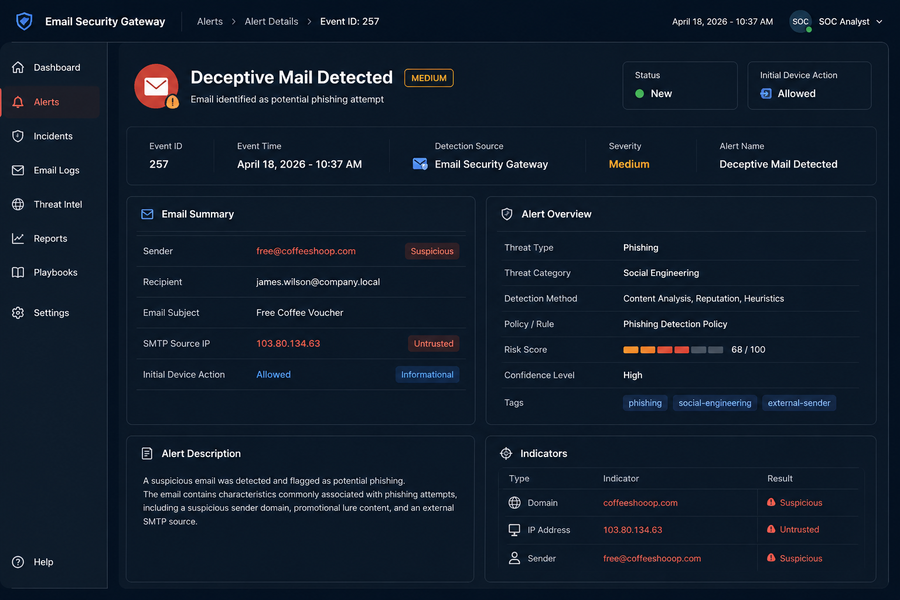
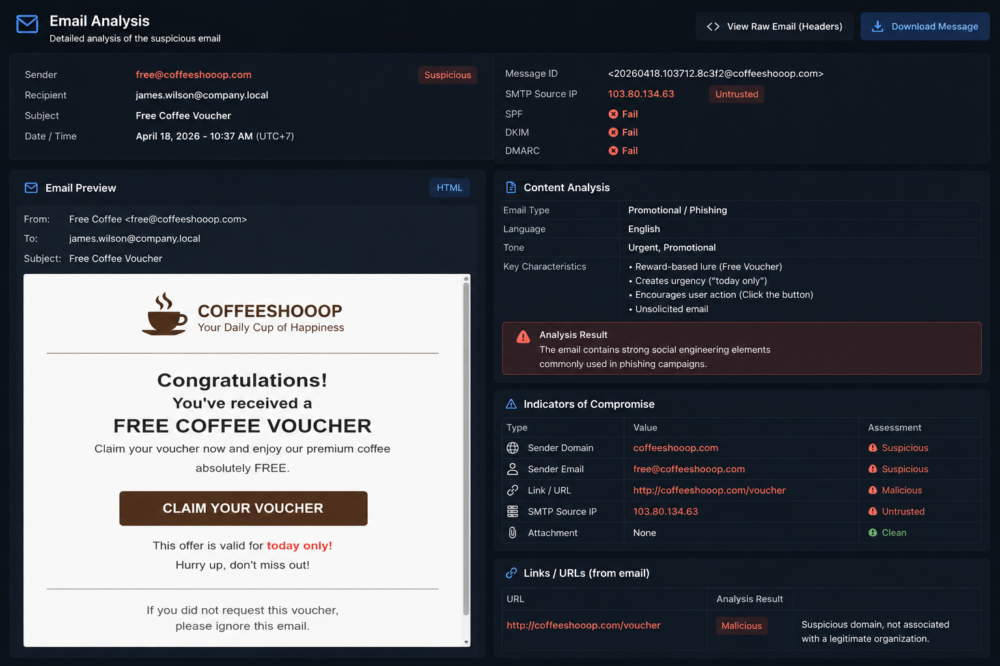
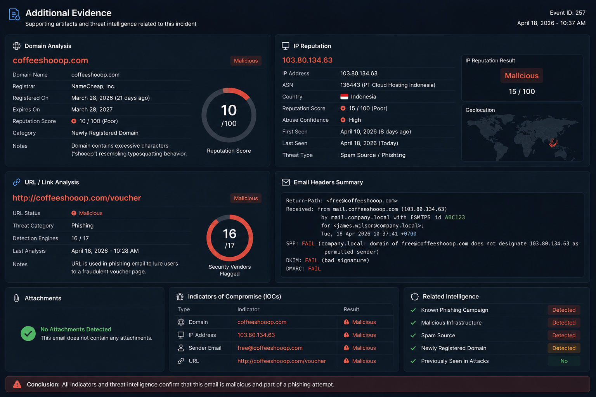

# Incident Report: Deceptive Phishing Email Investigation

---

# 1. Executive Summary

A suspicious email was detected by the email security monitoring system and flagged as a potential phishing attempt targeting internal users.

The investigation identified multiple phishing indicators including a spoofed sender domain, social engineering techniques, and suspicious email content designed to lure recipients into interacting with a fraudulent offer.

Further analysis confirmed that the email was malicious and classified as a **True Positive phishing incident**.

---

# 2. Alert Details

| Field                 | Value                                                           |
| --------------------- | --------------------------------------------------------------- |
| Alert Name            | Deceptive Mail Detected                                         |
| Severity              | Medium                                                          |
| Detection Source      | Email Security Gateway                                          |
| Event ID              | 257                                                             |
| Event Time            | April 18, 2026 - 10:37 AM                                       |
| Recipient             | [james.wilson@company.local](mailto:james.wilson@company.local) |
| Sender                | [free@coffeeshooop.com](mailto:free@coffeeshooop.com)           |
| SMTP Address          | 103.80.134.63                                                   |
| Email Subject         | Free Coffee Voucher                                             |
| Initial Device Action | Allowed                                                         |

---

# 3. Investigation Process

## Step 1 — Initial Alert Triage

The alert was reviewed to determine whether the email represented a legitimate business communication or a phishing attempt.

### Indicators observed during the triage phase:

* Suspicious sender domain
* Promotional lure content
* External sender activity
* Unexpected email subject
* Potential impersonation attempt

Due to multiple phishing indicators, the alert was escalated for further investigation.

---

## Step 2 — Sender Analysis

The sender address:

```text
free@coffeeshooop.com
```

was analyzed for legitimacy and domain reputation.

### Findings:

* The domain contained excessive characters ("shooop")
* The sender domain was not associated with a legitimate business entity
* The naming pattern resembled typosquatting behavior commonly used in phishing campaigns

These indicators strongly suggested spoofing or phishing activity.

---

## Step 3 — Email Content Analysis

The email subject:

```text
Free Coffee Voucher
```

was analyzed for social engineering characteristics.

### Observed phishing indicators:

* Reward-based social engineering lure
* Promotional click-bait language
* Unsolicited message content
* User interaction encouragement

The wording pattern aligned with common phishing campaigns designed to harvest user clicks or credentials.

---

## Step 4 — Infrastructure Analysis

The SMTP source IP:

```text
103.80.134.63
```

was reviewed as part of the investigation.

### Analysis objectives:

* Validate sender reputation
* Identify suspicious infrastructure
* Determine legitimacy of the sending source

The source behavior appeared suspicious and inconsistent with trusted enterprise email infrastructure.

---

# 4. Findings

The investigation identified several malicious indicators:

| Indicator                   | Result         |
| --------------------------- | -------------- |
| Suspicious Domain           | Detected       |
| Typosquatting Behavior      | Detected       |
| Social Engineering Content  | Detected       |
| Untrusted SMTP Source       | Detected       |
| Legitimate Business Context | Not Identified |

---

# 5. MITRE ATT&CK Mapping

| Technique ID | Technique              |
| ------------ | ---------------------- |
| T1566        | Phishing               |
| T1583        | Acquire Infrastructure |
| T1204        | User Execution         |

---

# 6. Timeline of Investigation

| Time     | Activity                                 |
| -------- | ---------------------------------------- |
| 10:37 AM | Alert generated by email security system |
| 10:41 AM | Initial triage performed                 |
| 10:48 AM | Sender domain analysis completed         |
| 10:55 AM | Email content reviewed                   |
| 11:03 AM | Threat classified as phishing            |
| 11:08 AM | Containment recommendations documented   |

---

# 7. Impact Assessment

Potential risks associated with this phishing email included:

* Credential harvesting
* Malware delivery
* Unauthorized account access
* User compromise
* Internal phishing propagation

Although no successful user interaction was confirmed, the email represented a credible phishing threat to the environment.

---

# 8. Verdict

✅ True Positive

The email was confirmed to be a phishing attempt based on sender analysis, domain characteristics, infrastructure review, and social engineering indicators.

---

# 9. Response & Containment Recommendations

Recommended response actions:

* Block the sender domain
* Block the suspicious SMTP IP address
* Remove similar emails from user mailboxes
* Increase email monitoring visibility
* Conduct phishing awareness training
* Strengthen email filtering policies

---

# 10. SOC Analyst Notes

This investigation demonstrated the importance of:

* Email threat triage
* Sender reputation analysis
* Social engineering detection
* Infrastructure validation
* Structured incident documentation

The incident highlights how phishing campaigns leverage deceptive domains and persuasive messaging to target end users.

---

# 11. Evidence & Screenshots

## Alert Overview



## Email Analysis



## Additional Evidence



---

# 12. Report Information

| Field              | Details                |
| ------------------ | ---------------------- |
| Report Prepared By | Syalom Marventeen      |
| Role               | Aspiring SOC Analyst   |
| Report Date        | April 18, 2026         |

---
